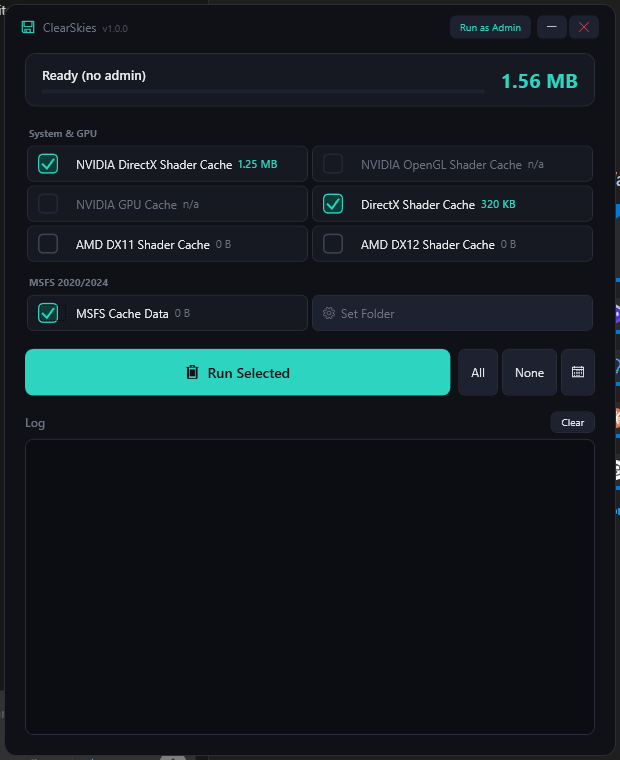
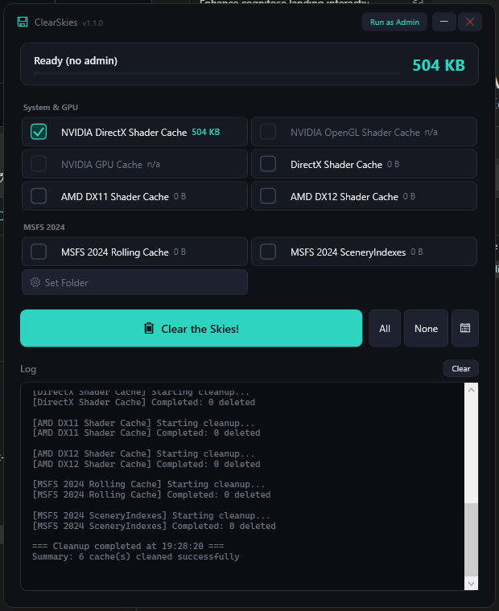

# ClearSkies

A native Windows application to clean NVIDIA, AMD, and DirectX shader caches, as well as Microsoft Flight Simulator cache data.




> **Disclaimer:** This software is provided "as is", without warranty of any kind. Use it at your own risk. The author is not responsible for any data loss, system issues, or other damages that may result from using this application. Always ensure important data is backed up before performing any cleanup operations.

## Features

- **Multi-Cache Support**: Cleans multiple shader cache types:
  - NVIDIA DirectX Shader Cache
  - NVIDIA OpenGL Shader Cache
  - NVIDIA GPU Cache
  - DirectX Shader Cache (D3DSCache)
  - AMD Shader Caches (DX11 & DX12)

- **MSFS Auto-Detection**: Automatically detects MSFS 2020 and 2024 installations (Steam and MS Store)
  - Rolling Cache (.ccc files) cleanup
  - SceneryIndexes cleanup (fixes missing scenery and reduces load times)
  - Manual folder picker available as fallback

- **Cache Size Display**: Shows the size of each cache before cleaning

- **Selective Cleaning**: Choose which caches to clean with checkboxes

- **Live Deletion Log**: Real-time log showing exactly which files are being deleted
  - See every file removed during cleanup
  - Track skipped files (locked/in-use)
  - View summary statistics

- **Locked File Handling**: Files in use are automatically scheduled for deletion on the next system restart (requires Administrator)

- **Automatic Scheduling**: Set up automatic cache cleaning using Windows Task Scheduler
  - Daily, Weekly, or Monthly schedules
  - Custom time selection

## Requirements

- Windows 10/11
- Administrator privileges recommended (for locked file handling and scheduling)

## Installation

1. Download the latest release
2. Extract to a folder of your choice
3. Run `ClearSkies.exe`

## Usage

### Manual Cleaning

1. Launch the application
2. Caches are automatically scanned on launch
3. Select the caches you want to clean (or use **All**/**None** buttons)
4. Click **"Clear the Skies!"** to remove the cached files
5. Confirm the deletion when prompted
6. Watch the live log at the bottom to see which files are being deleted in real-time

### MSFS Cache

MSFS 2020 and 2024 installations are **automatically detected** (both Steam and MS Store versions). The app will find and display:
- **Rolling Cache** — large .ccc cache files
- **SceneryIndexes** — scenery index data that can become corrupted

If auto-detection doesn't find your installation, use **"Set Folder"** to manually select the MSFS cache directory.

### Scheduled Cleaning

1. Click the **"Schedule..."** button
2. Enable **"Enable Automatic Cache Cleaning"**
3. Choose frequency (Daily, Weekly, or Monthly)
4. Set the time for automatic cleaning
5. Click **"Apply"**

**Note**: Creating scheduled tasks requires Administrator privileges.

### Command Line

The application supports silent cleaning via command line:

```bash
ClearSkies.exe /clean
```

This is used by the Task Scheduler for automatic cleaning.

## Why Clean Shader Caches?

Shader caches can accumulate over time and consume significant disk space. Cleaning them can:

- Free up disk space (often several GB)
- Resolve graphics issues or corruption
- Improve game performance in some cases
- Prepare for major game updates

Games will automatically rebuild shader caches as needed, so it's safe to delete them.

## Building from Source

### Prerequisites

- Visual Studio 2022 or later
- .NET 8.0 SDK

### Build

```bash
cd ClearSkies
dotnet build
```

### Publish (single-file exe)

```bash
dotnet publish -c Release -r win-x64 --self-contained true
```

## Troubleshooting

**"Not running as Administrator" warning**:
- Some caches require admin rights to access
- Right-click the app and select "Run as Administrator"

**Some files won't delete**:
- Files in use by running applications are skipped
- When running as Administrator, locked files are scheduled for deletion on reboot
- Close graphics-intensive applications before cleaning for best results

## License

This project is licensed under the [MIT License](LICENSE).

## Author

purcilas
