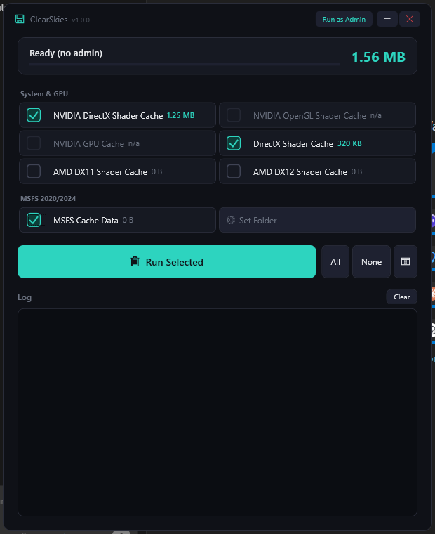
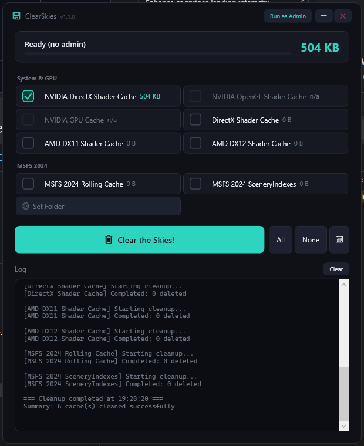

# ClearSkies

A native Windows application to clean NVIDIA, AMD, and DirectX shader caches, as well as Microsoft Flight Simulator cache data.

**Latest release: [v1.1.1](https://github.com/purcilas/ClearSkies/releases/tag/v1.1.1)** — [Download Windows x64 executable](https://github.com/purcilas/ClearSkies/releases/download/v1.1.1/ClearSkies.exe) · [Changelog](CHANGELOG.md)

> **Important safety update:** Before v1.1.1, manually selecting a broad folder could cause unrelated files inside it to be deleted recursively. Update before using manual-folder cleanup. v1.1.1 restricts manual cleanup to `ROLLINGCACHE.CCC`, ignores invalid saved paths, and stops scheduling deletions after reboot. It does not cancel deletion requests already queued by older versions.




> **Disclaimer:** This software is provided "as is", without warranty of any kind. Use it at your own risk. The author is not responsible for any data loss, system issues, or other damages that may result from using this application. Always ensure important data is backed up before performing any cleanup operations.

## Features

- **Multi-Cache Support**: Cleans multiple shader cache types:
  - NVIDIA DirectX Shader Cache
  - NVIDIA OpenGL Shader Cache
  - NVIDIA GPU Cache
  - DirectX Shader Cache (D3DSCache)
  - AMD Shader Caches (DX11 & DX12)

- **MSFS Auto-Detection**: Automatically detects MSFS 2020 and 2024 installations (Steam and MS Store)
  - Rolling Cache (`ROLLINGCACHE.CCC` only) cleanup
  - SceneryIndexes cleanup (fixes missing scenery and reduces load times)
  - Manual folder picker available as fallback

- **Cache Size Display**: Shows the size of each cache before cleaning

- **Selective Cleaning**: Choose which caches to clean with checkboxes

- **Live Deletion Log**: Real-time log showing exactly which files are being deleted
  - See every file removed during cleanup
  - Track skipped files (locked/in-use)
  - View summary statistics

- **Locked File Handling**: Locked or inaccessible files are skipped; cleanup never schedules deletions on restart.
- **Safe Manual Selection**: Only `ROLLINGCACHE.CCC` is eligible in a manually selected folder. Package roots resolve to `LocalCache` when that file exists. Folder links and junctions are not followed.

- **Automatic Scheduling**: Set up automatic cache cleaning using Windows Task Scheduler
  - Daily, Weekly, or Monthly schedules
  - Custom time selection

## Requirements

- Windows 10/11
- Administrator privileges may be needed for protected cache folders and creating scheduled tasks. Locked files are skipped even when elevated.

## Installation

1. Download [ClearSkies.exe](https://github.com/purcilas/ClearSkies/releases/download/v1.1.1/ClearSkies.exe).
2. Save it in a folder of your choice. When upgrading, close ClearSkies and replace the previous executable.
3. Run `ClearSkies.exe`. The Windows x64 download is self-contained; no separate .NET installation is required.

## Usage

### Manual Cleaning

1. Launch the application
2. Caches are automatically scanned on launch
3. Select the caches you want to clean (or use **All**/**None** buttons)
4. Click **"Clear the Skies!"** to remove the cached files
5. Confirm the deletion when prompted
6. Watch the live log at the bottom to see which files are being deleted in real-time

### NVIDIA App shader cache option

Recent NVIDIA App versions provide their own shader cache cleanup. ClearSkies includes an **NVIDIA DirectX cache: NVIDIA App instructions** button with directions and an option to open the app when found in its standard installation location.

When you click **Clear the Skies!** with **NVIDIA DirectX Shader Cache** selected, an automatic prompt offers these instructions before any cleanup starts. Choosing the NVIDIA instructions stops that cleanup attempt. Scheduled `/clean` runs remain noninteractive.

1. Close MSFS and other games.
2. Open **NVIDIA App > Graphics > Global Settings > Shader Cache** (sometimes labeled **Shader Cache Size**).
3. Open the **three-dot menu > Clear cache** and follow NVIDIA's confirmation prompts.
4. Wait for cleanup to finish, then enable **Auto Shader Compilation (beta)** if needed.
5. Open the **three-dot menu > Compile now** to rebuild supported shaders in NVIDIA App.
6. Wait for compilation to finish before launching MSFS or other games.

If **Clear cache** or **Compile now** is missing, update NVIDIA App and the graphics driver, then check again. Availability varies by version. NVIDIA clears most cache files; compilation supports eligible DirectX 12 shaders, and games may still compile additional shaders when played. Uncheck **NVIDIA DirectX Shader Cache** in ClearSkies if using NVIDIA App instead.

ClearSkies opens NVIDIA App but does not automatically invoke its internal cleanup handler. No supported public command-line/API entry point was identified. NVIDIA's separate [manual deletion instructions](https://nvidia.custhelp.com/app/answers/detail/a_id/5735) include restarts; do not assume those instructions and the in-app action are interchangeable.

### MSFS Cache

MSFS 2020 and 2024 installations are **automatically detected** (both Steam and MS Store versions). The app will find and display:

- **Rolling Cache** — only `ROLLINGCACHE.CCC`; manual caches are preserved
- **SceneryIndexes** — scenery index data that can become corrupted

If the rolling cache is in a custom location, use **"Set Folder"** to select the folder containing `ROLLINGCACHE.CCC`. You can also select an MSFS package root if `LocalCache` contains that file. Manual selection never enables general folder cleanup. Invalid saved manual paths are ignored, including during scheduled cleanup. Cache paths are displayed on each card and in the cleanup confirmation.

Deleting the rolling cache can reset its size when MSFS recreates it. Restore your preferred size in the simulator afterward.

### Scheduled Cleaning

1. Click the **"Schedule..."** button
2. Enable **"Enable Automatic Cache Cleaning"**
3. Choose frequency (Daily, Weekly, or Monthly)
4. Set the time for automatic cleaning
5. Click **"Apply"**

**Note**: Creating scheduled tasks requires Administrator privileges.

### Command Line

The application supports silent cleaning via command line:

```bash
ClearSkies.exe /clean
```

This is used by the Task Scheduler for automatic cleaning.

## Why Clean Shader Caches?

Shader caches can accumulate over time and consume significant disk space. Cleaning them can:

- Free up disk space (often several GB)
- Resolve graphics issues or corruption
- Improve game performance in some cases
- Prepare for major game updates

Games rebuild shader caches as needed. The first runs after cleanup may stutter while shaders compile; routine deletion is not necessary when games are working normally.

## Building from Source

### Prerequisites

- Visual Studio 2022 or later
- .NET 8.0 SDK

### Build

```bash
cd ClearSkies
dotnet build
```

### Publish (single-file exe)

```bash
dotnet publish -c Release -r win-x64 --self-contained true
```

### Safety regression checks

From the repository root, run:

```powershell
dotnet run --project tests/ClearSkies.SafetyTests.csproj
```

These checks use newly created temporary fixtures, never real simulator caches. They cover broad manual folders, preserved user files, modified cleanup targets, locked files, and directory junctions. Fixtures are retained at the path printed by the test runner.

## Troubleshooting

**"Not running as Administrator" warning**:
- Some caches require admin rights to access
- Right-click the app and select "Run as Administrator"

**Some files won't delete**:
- Files in use by running applications are skipped
- No deletions are scheduled on reboot, including when running as Administrator
- Close graphics-intensive applications before cleaning for best results

## License

This project is licensed under the [MIT License](LICENSE).

## Author

purcilas
